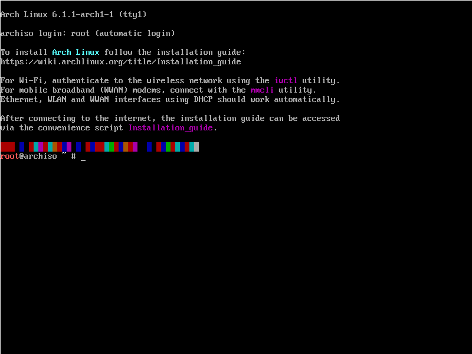

Ako asi (ne) viete, ja mám veľmi rád distrohopovanie. Je to aktivita, keď striedam viacero distribúcií, často aj v jeden deň. A vždy sa snažím túto aktivitu zastaviť. Prečo? Lebo je to prosté zlé. Je to to isté, ako keby ste húlili, len pri tom navyše strácate svoje dáta. Ale rozhodol som sa s tým skončiť. A to tak, že mojou ****„poslednou“**** distribúciou bude Arch Linux.

# Inštalácia

Arch sa v novších verziách inštaluje pomerne jednoducho. Nové snapshoty ISO „Archu“ majú inštalačný program, ktorý sa volá Archinstall. Keď sa nabootujete do Arch Linuxu, tak sa Vám zobrazí prostý príkazový riadok, čo je inak ``zsh``. Potom sa treba pripojiť k internetu, ale to bude trápiť len tých, ktorí ho chcú nainštalovať na notebooku/majú Wi-Fi kartu. A to sa dá urobiť následovné:

1. Napíšte ``iwctl``.
2. Potom napíšte ``station device list``.
3. Potom napíšte ``station <zariadenie, ktoré sa zobrazí, keď napíšete predchádzajúci príkaz> get-networks``. 
4. Potom napíšte ``station <zariadenie, ktoré sa zobrazí, keď napíšete predchádzajúci príkaz> connect <názov Wi-Fi, ku ktorej sa chcete pripojiť>``.
    - Ak tá Wi-Fi má heslo, tak sa Vám zobrazí pole, kde sa Vám síce nebudú zobrazovať hviezdičky, ale tam budete musieť zadať to heslo.

No a teraz môžete napísať príkaz ``archinstall``, potom chvíľku počkať a voilá, môžeme ísť inštalovať
## Jazyk
